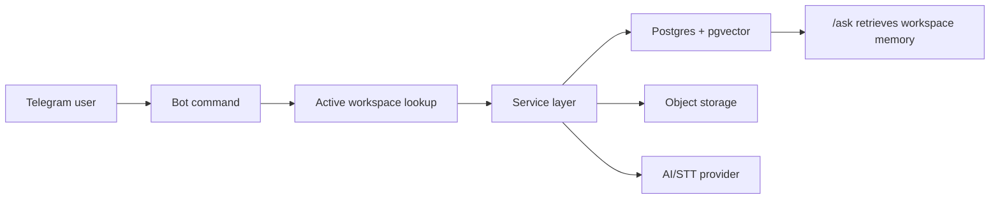

Основной сценарий начинается в Telegram. Пользователь выбирает проект, отправляет встречу или документ, Rhapsody сохраняет данные в Postgres, создаёт chunks и использует AI provider для извлечения структуры.

## Правило изоляции

Команды не должны выполнять глобальный поиск. Даже если у двух пользователей есть проект с одинаковым названием, память не смешивается: данные разделяются через `workspace_id`, membership и Telegram chat mapping.

## Быстрый путь пользователя

<Steps>
  <Step title="Создать проект">
    В личном чате выполнить `/new_project Alpha`.
  </Step>
  <Step title="Добавить встречу">
    Выполнить `/meeting` и отправить текст или файл заметок.
  </Step>
  <Step title="Спросить память">
    Выполнить `/ask Что решили по запуску?`.
  </Step>
  <Step title="Проверить задачи и решения">
    Использовать `/tasks` и `/decisions`.
  </Step>
</Steps>
