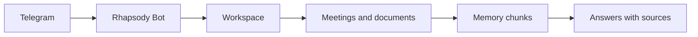

This page is the localized counterpart of the full Russian documentation. It keeps the same structure and explains the same Rhapsody behavior with real commands, environment variables, and endpoints.

<Warning>
Live-call recording remains marked as requiring manual validation in a real Telegram group call with a Recorder account.
</Warning>

## Useful commands

```bash
docker compose up --build -d
docker compose ps
curl http://localhost:8000/api/v1/health
python scripts/export_openapi.py
```

## Checks

- Use `X-API-Key` for protected HTTP endpoints.
- Keep project data scoped by `workspace_id`.
- Use `/new_project Alpha`, `/meeting`, `/document`, `/ask`, `/tasks`, `/decisions`, and `/audit` for the core Telegram flow.
- Use `/connect_calls`, `/listen`, `/live_status`, and `/stop_listen` only after Recorder setup.
- Do not publish real `.env`, Telegram tokens, API hashes, StringSession values, or provider keys.


