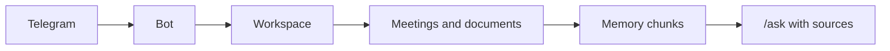

Rhapsody stores team context from Telegram: meetings, documents, decisions, tasks, risks, and important messages. A user selects a project, adds material, and asks questions against that project's memory with sources.

## First scenario

```text
/new_project Alpha

/meeting
We decided to use Gemini for the first demo.
Baktiyar will review the documents tomorrow.

/ask What did we decide about the AI provider?
```

Expected result: Rhapsody saves the meeting in the selected workspace, extracts tasks and decisions, and answers only from project `Alpha`.

<Warning>
Live-call recording has backend orchestration in this repository, but a full real Telegram group-call validation with a Recorder account is still required.
</Warning>

## Core architecture


