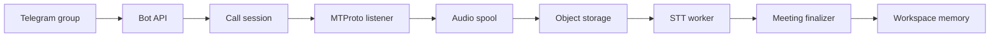

Telegram Bot API cannot join a group call directly. Rhapsody uses a separate Recorder account controlled by the listener service through MTProto.



User flow:

```text
Add Rhapsody Bot
→ connect the assigned Recorder
→ start a call
→ run /listen
→ receive the result
```

<Warning>
Do not ask ordinary users for Telegram API ID, API hash, or StringSession. These belong to the operator/private deployment flow.
</Warning>
