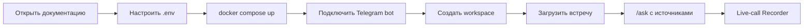

Rhapsody сохраняет рабочий контекст команды из Telegram: встречи, документы, решения, задачи, риски и важные сообщения. Пользователь выбирает проект, добавляет материалы, а затем задаёт вопросы к памяти проекта и получает ответ с источниками.

<CardGroup cols={2}>
  <Card title="Быстрый старт" icon="rocket" href="/quickstart">
    Запустите Docker Compose, проверьте API и подключите Telegram-бота.
  </Card>
  <Card title="Telegram" icon="send" href="/telegram/connect-bot">
    Настройте бота, личные чаты, группы и основные команды.
  </Card>
  <Card title="Live-звонки" icon="radio" href="/live-calls/overview">
    Поймите Recorder, MTProto listener, audio chunks и STT pipeline.
  </Card>
  <Card title="API Reference" icon="braces" href="/api-reference/overview">
    Используйте реальные HTTP endpoints из FastAPI OpenAPI schema.
  </Card>
</CardGroup>

## Первый сценарий

```text
/new_project Alpha

/meeting
Мы решили использовать Gemini.
Бактияр должен проверить документы завтра.

/ask Что мы решили?
```

Ожидаемый результат: Rhapsody сохраняет встречу в выбранном workspace, извлекает summary, tasks, decisions и memory chunks, а команда `/ask` отвечает только из памяти проекта `Alpha`.

<Warning>
Live-call recording в текущем репозитории имеет backend orchestration и readiness endpoints, но требует ручной проверки в реальном Telegram-звонке с Recorder account.
</Warning>

## Как читать документацию

Начните с архитектуры и быстрого запуска, затем настройте Telegram-бота, создайте проект, загрузите встречу или документ и только после этого переходите к live-call Recorder.


