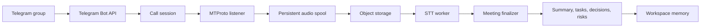

Telegram Bot API не подключается к групповому звонку напрямую. Поэтому Rhapsody использует отдельный Recorder account: обычный Telegram user session, которым управляет listener service через MTProto.

## Термины

- Bot API: обычный Telegram bot, принимает команды `/listen`, `/stop_listen`, `/live_status`.
- MTProto: Telegram protocol для user session.
- Recorder account: Telegram user account, добавляемый в группу для записи звонка.
- Listener service: контейнер `listener`, который управляет подключением Recorder.
- Call session: запись состояния звонка в `call_sessions`.
- Audio chunk: фрагмент audio в `call_audio_chunks`.
- STT: speech-to-text обработка chunk.
- AI finalization: summary, tasks, decisions, risks и memory chunks.

<Warning>
Полный реальный Telegram group-call сценарий ещё не подтверждён ручным тестом в этом репозитории. Документируйте его как экспериментальную возможность.
</Warning>
