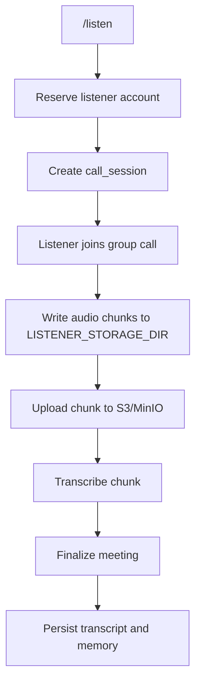
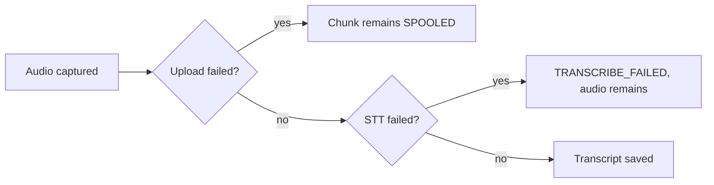

## Persistent spool

`LISTENER_STORAGE_DIR` по умолчанию `/var/lib/rhapsody/listener`. В Docker Compose он монтируется в volume `listener_spool`, чтобы audio chunks не исчезали при коротком restart.

## Повторные попытки

`call_audio_chunks` содержит `attempt_count`, `failure_code`, `failure_message` и `status`. Это позволяет повторять upload/transcribe шаги.

## Failure isolation

