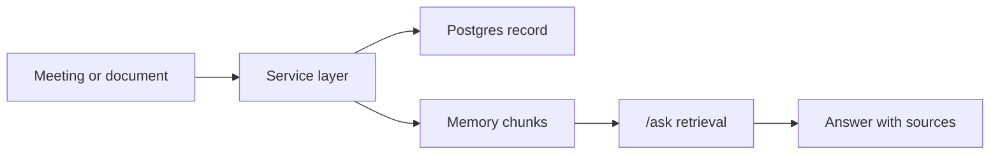

Rhapsody сохраняет память как факты, привязанные к workspace. Для поиска используется таблица `memory_chunks` с полями `source_type`, `source_id`, `content`, `source_title`, `source_url` и optional embedding.

## Источники памяти

- Meetings: текст встречи, transcript или recording result.
- Documents: текстовые документы и поддержанные файлы.
- Messages: важные Telegram события через ingestion service.
- Tasks, decisions, risks: извлекаются из встреч и доступны как отдельные сущности.

## Поведение при ошибках

Если LLM не отвечает, уже сохранённый transcript или документ не должен удаляться. Если STT падает, audio chunk остаётся в spool/object storage для повторной обработки.
