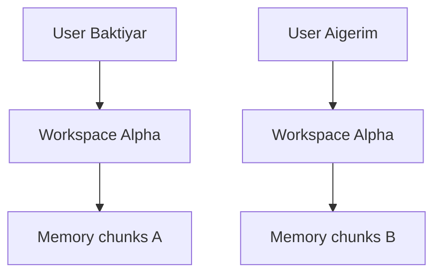

Главное правило: все пользовательские данные должны иметь `workspace_id`.

Даже если два проекта называются `Alpha`, они остаются разными workspace.

## Что важно

- Команды не должны искать память глобально.
- Telegram group binding не делает всех участников member workspace.
- Пользователь должен иметь membership.
- Для чтения памяти требуется permission `READ_MEMORY`.
- Для audit требуется `VIEW_AUDIT`.
- Для задач и решений требуются `MANAGE_TASKS` и `MANAGE_DECISIONS`.

<Info>
Автоматические тесты покрывают project isolation и group hijack regression. Реальная проверка со вторым Telegram user пока отмечена как pending manual validation.
</Info>
