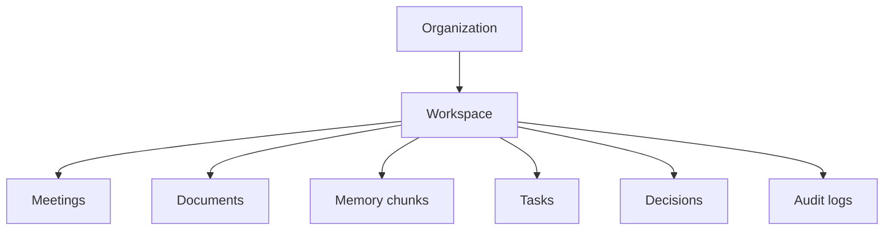

Rhapsody — это backend и Telegram-first продуктовый прототип для командной памяти. Он не является обычным чат-ботом: все данные привязаны к workspace, а ответы строятся из сохранённых встреч, документов, сообщений, задач и решений.

## Что делает система

- Создаёт организации, workspace, пользователей и membership.
- Привязывает Telegram private chat или group chat к активному workspace.
- Принимает встречи, документы, audio/voice и важные сообщения.
- Создаёт memory chunks с `workspace_id`.
- Отвечает на `/ask` только в рамках выбранного проекта.
- Ведёт tasks, decisions и audit log.
- Готовит pipeline для Telegram live-call recording через Recorder account и listener service.

## Что не нужно считать готовым

<Warning>
Frontend admin console пока не является основным пользовательским интерфейсом. Реальный live-call сценарий с Recorder account требует ручной проверки в Telegram.
</Warning>

## Главная модель

В коде проект представлен таблицей `workspaces`. Организация может иметь много workspace. Память, документы, задачи, решения, звонки и audit events разделяются через `workspace_id`.

